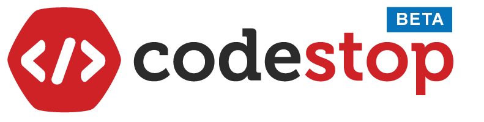

# Working with Layouts

+++ 

### Part 1: Sample Code Analysis

:::

/// type=REPL, readonly=true

```html
<!DOCTYPE html>
<html>
    <head>
        <title>Sample Code Analysis</title>
    </head>
    <body>
        <header style="text-align: center">
            
        </header>
        <nav>
            <ul type="disc">
                <li><a href="https://codestop.io/">Codestop Website</a></li>
                <li><a href="https://codestop.io/about-us">About</a></li>
                <li><a href="https://codestop.io/courses">Courses Offered</a></li>
                <li><a href="https://codestop.io/register/">Sign Up</a></li>
            </ul>
        </nav>
        <hr />
    </body>
</html>

```

/// type=SS, answer=[5]

Execute the program. What is its output?

- <header style="text-align: center"></header>

- <header></header><nav><ul type="disc"><li><a href="https://codestop.io/">Codestop Website</a></li><li><a href="https://codestop.io/about-us">About</a></li><li><a href="https://codestop.io/courses">Courses Offered</a></li><li><a href="https://codestop.io/register/">Sign Up</a></li></ul></nav><hr />

- <header style="text-align: center"></header><nav><ul type="disc"><li><a href="https://codestop.io/">Codestop Website</a></li><li><a href="https://codestop.io/about-us">About</a></li><li><a href="https://codestop.io/courses">Courses Offered</a></li></ul></nav>

- <header style="text-align: center"><h1>Codestop</h1></header><nav><ul type="disc"><li><a href="https://codestop.io/">Codestop Website</a></li><li><a href="https://codestop.io/about-us">About</a></li><li><a href="https://codestop.io/courses">Courses Offered</a></li><li><a href="https://codestop.io/register/">Sign Up</a></li></ul></nav><hr />

- <header style="text-align: center"></header><nav><ul type="disc"><li><a href="https://codestop.io/">Codestop Website</a></li><li><a href="https://codestop.io/about-us">About</a></li><li><a href="https://codestop.io/courses">Courses Offered</a></li><li><a href="https://codestop.io/register/">Sign Up</a></li></ul></nav><hr />


/// type=SS, answer=[3]

Which list item marker type is rendered on the browser window?

- `Numbers`

- `Letters`

- `Empty circles`

- `Filled-in circles`

- `Filled-in squares`


/// type=SS, answer=[2]

On line 10, what does the `type` attribute do?

- It defines the order of the list items.

- It defines the type of list item markers.

- It sets the definition term of the list items.

- It defines the list of terms with descriptions.

- It specifies the starting point of the list items in an ordered list.


/// type=SS, answer=[4]

On line 8, what does the `<ul>` tag do?

- It defines a term.

- It defines an item list.

- It defines an ordered list.

- It defines an unordered list.

- It defines a description list.


/// type=SS, answer=[2]

What is `<li>` inside the element `<ul>`?

- It defines a term.

- It defines an item list.

- It defines an ordered list.

- It defines an unordered list.

- It defines a description list.


/// type=SS, answer=[4]

On line 12, what is `<a href="https://codestop.io/">Codestop Website</a>`?

- It is a link element.

- It is a head element.

- It is a title element.

- It is an anchor element.

- It is a paragraph element.


/// type=SS, answer=[2]

On line 8, what is ``?

- It is a link element.

- It is an image element.

- It is a header element. 

- It is an item list element. 

- It is an unordered list element. 


/// type=SS, answer=[2]

On line 10, what is `<nav>`?

- It is an element that contains the RSS content of a page.

- It is an element that contains the navigation links of a page.

- It is an element that contains the introductory content of a page.

- It is an element that is used to indicate the footer part of a document.

- It is an element that is used to group contents base on purpose or subject.


/// type=SS, answer=[2]

Which of the following elements is the introductory content of the HTML document?

- `<header style="text-align: center">`

- ``

- `a href="https://codestop.io/">Codestop Website</a>`

- `<a href="https://codestop.io/register/">Sign Up</a>`

- `<li><a href="https://codestop.io/about-us">About</a></li>`


/// type=SS, answer=[3]

On line 7, what is `<header>`?

- It is an element that contains the RSS content of a page.

- It is an element that contains the navigation links of a page.

- It is an element that contains the introductory content of a page.

- It is an element that is used to indicate the footer part of a document.

- It is an element that is used to group contents base on purpose or subject.


/// type=MS, answer=[3,4,5]

Which of the following elements are navigation links of the HTML document?

- `<header style="text-align: center">`

- ``

- `a href="https://codestop.io/">Codestop Website</a>`

- `<a href="https://codestop.io/register/">Sign Up</a>`

- `<li><a href="https://codestop.io/about-us">About</a></li>`


:::

:::

/// type=REPL, readonly=true

```html
<!DOCTYPE html>
<html>
    <head>
        <title>Sample Code Analysis</title>
    </head>
    <body>
        <header style="text-align: center">
            
        </header>
        <nav>
            <ul type="disc">
                <li><a href="https://codestop.io/">Codestop Website</a></li>
                <li><a href="https://codestop.io/about-us">About</a></li>
                <li><a href="https://codestop.io/courses">Courses Offered</a></li>
                <li><a href="https://codestop.io/register/">Sign Up</a></li>
            </ul>
        </nav>
        <hr />
         <section>
            <h1>Learning by Coding</h1>
            <p>"The goal of CodeStop is to design programming courses that are affordable to young people in developing nations. Ultimately, we want young people to build the path to a sustainable career through technology."</p>
        </section>
    </body>
</html>

```

/// type=SS, answer=[2]

Execute the program. What is its output?

- <header></header><nav><ul type="disc"><li><a href="https://codestop.io/">Codestop Website</a></li><li><a href="https://codestop.io/about-us">About</a></li><li><a href="https://codestop.io/courses">Courses Offered</a></li><li><a href="https://codestop.io/register/">Sign Up</a></li></ul></nav><hr /><section><h1>Learning by Coding</h1><p>"The goal of CodeStop is to design programming courses that are affordable to young people in developing nations. Ultimately, we want young people to build the path to a sustainable career through technology."</p></section>

- <header style="text-align: center"></header><nav><ul type="disc"><li><a href="https://codestop.io/">Codestop Website</a></li><li><a href="https://codestop.io/about-us">About</a></li><li><a href="https://codestop.io/courses">Courses Offered</a></li><li><a href="https://codestop.io/register/">Sign Up</a></li></ul></nav><hr /><section><h1>Learning by Coding</h1><p>"The goal of CodeStop is to design programming courses that are affordable to young people in developing nations. Ultimately, we want young people to build the path to a sustainable career through technology."</p></section>

- <header style="text-align: center"></header><hr /><section><h1>Learning by Coding</h1><p>"The goal of CodeStop is to design programming courses that are affordable to young people in developing nations. Ultimately, we want young people to build the path to a sustainable career through technology."</p></section>

- <header style="text-align: center"></header><nav><ul type="disc"><li><a href="https://codestop.io/">Codestop Website</a></li><li><a href="https://codestop.io/about-us">About</a></li><li><a href="https://codestop.io/courses">Courses Offered</a></li><li><a href="https://codestop.io/register/">Sign Up</a></li></ul></nav><hr />

- <header style="text-align: center"></header><nav><ul type="disc"><li><a href="https://codestop.io/">Codestop Website</a></li><li><a href="https://codestop.io/about-us">About</a></li><li><a href="https://codestop.io/courses">Courses Offered</a></li><li><a href="https://codestop.io/register/">Sign Up</a></li></ul></nav><hr /><section><h1>Learning by Coding</h1><p>"The goal of CodeStop is to design programming courses that are affordable to young people in developing nations. Ultimately, we want young people to build the path to a sustainable career through technology."</p></section>


/// type=SS, answer=[5]

What is `<hr />` after the element `<nav>`?

- It is an element that renders a smaller font. 

- It is an element that defines an inserted text or added text.

- It is an element that defines the marked or highlighted text.

- It is an empty element that defines a line break in a paragraph.

- It is an empty element that draws horizontal line between text to separate content. 


/// type=SS, answer=[3]

On line 7, which statement best describes `text-align: center` inside the element `<header style="text-align: center">`?

- It is a unique id value that identifies the element.

- It is the local tag value supporting the `<p>` element.

- It is the attribute value of the attribute name style.

- It is an attribute name that defines a specific style to the element.

- It is an identifier value that sets the style settings for the `<p>` element.


/// type=SS, answer=[4]

On line 8, what does the `href` attribute do in the element `<a href="https://codestop.io/">Codestop Website</a>`?

- It defines the location of web pages.

- It defines the address of the current page.

- It defines the connection between web pages.

- It defines the destination address of the page to be linked.

- It defines the specific location where the linked page will open.


/// type=SS, answer=[5]

On line 20, what is `<section>`?

- It is an element that contains the RSS content of a page.

- It is an element that contains the navigation links of a page.

- It is an element that contains the introductory content of a page.

- It is an element that is used to indicate the footer part of a document.

- It is an element that is used to group contents base on purpose or subject.


/// type=MS, answer=[3,4,5]

What are the elements used to group elements in different stuctural blocks?

- `<ul>`

- `<li>`

- `<nav>`

- `<header>`

- `<section>`


:::

:::

/// type=REPL, readonly=true

```html
<!DOCTYPE html>
<html>
    <head>
        <title>Sample Code Analysis</title>
    </head>
    <body>
        <header style="text-align: center">
            
        </header>
        <nav>
            <ul type="disc">
                <li><a href="https://codestop.io/">Codestop Website</a></li>
                <li><a href="https://codestop.io/about-us">About</a></li>
                <li><a href="https://codestop.io/courses">Courses Offered</a></li>
                <li><a href="https://codestop.io/register/">Sign Up</a></li>
            </ul>
        </nav>
        <hr />
         <section style="text-align: justify">
            <h1>Learning by Coding</h1>
            <p>"The goal of CodeStop is to design programming courses that are affordable to young people in developing nations.<br /> Ultimately, we want young people to build the path to a sustainable career through technology."</p>
        </section>
        <aside style="text-align: right">
            <p>"We designed our platform to make programming easy to learn, understand, and share." - <b>codestop</b></p>
        </aside>
        <article>
            <p>"Codestop a platform for learning to program and code since 2017."</p>
        </article>
    </body>
</html>

```

/// type=SS, answer=[2]

Execute the program. What is its output?

- <body><header style="text-align: center"></header><nav><ul type="disc"><li><a href="https://codestop.io/">Codestop Website</a></li><li><a href="https://codestop.io/about-us">About</a></li><li><a href="https://codestop.io/courses">Courses Offered</a></li><li><a href="https://codestop.io/register/">Sign Up</a></li></ul></nav><hr /><section><h1>Learning by Coding</h1><p>"The goal of CodeStop is to design programming courses that are affordable to young people in developing nations.<br /> Ultimately, we want young people to build the path to a sustainable career through technology."</p></section><aside><p>"We designed our platform to make programming easy to learn, understand, and share." - <b>codestop</b></p></aside><article><p>"Codestop a platform for learning to program and code since 2017."</p></article></body>

- <body><header style="text-align: center"></header><nav><ul type="disc"><li><a href="https://codestop.io/">Codestop Website</a></li><li><a href="https://codestop.io/about-us">About</a></li><li><a href="https://codestop.io/courses">Courses Offered</a></li><li><a href="https://codestop.io/register/">Sign Up</a></li></ul></nav><hr /><section><h1>Learning by Coding</h1><p>"The goal of CodeStop is to design programming courses that are affordable to young people in developing nations.<br /> Ultimately, we want young people to build the path to a sustainable career through technology."</p></section><aside style="text-align: right"><p>"We designed our platform to make programming easy to learn, understand, and share." - <b>codestop</b></p></aside><article><p>"Codestop a platform for learning to program and code since 2017."</p></article></body>

- <body><header></header><nav><ul type="disc"><li><a href="https://codestop.io/">Codestop Website</a></li><li><a href="https://codestop.io/about-us">About</a></li><li><a href="https://codestop.io/courses">Courses Offered</a></li><li><a href="https://codestop.io/register/">Sign Up</a></li></ul></nav><hr /><section>ing courses that are affordable to young people in developing nations.<br /> Ultimately, we want young people to build the path to a sustainable career through technology."</p></section><aside style="text-align: right"><p>"We designed our platform to make programming easy to learn, understand, and share." - <b>codestop</b></p></aside><article><p>"Codestop a platform for learning to program and code since 2017."</p></article></body>

- <body><header style="text-align: center"></header><nav><ul type="disc"><li><a href="https://codestop.io/about-us">About</a></li><li><a href="https://codestop.io/courses">Courses Offered</a></li><li><a href="https://codestop.io/register/">Sign Up</a></li></ul></nav><hr /><section><h1>Learning by Coding</h1><p>"The goal of CodeStop is to design programming courses that are affordable to young people in developing nations.<br /> Ultimately, we want young people to build the path to a sustainable career through technology."</p></section><aside style="text-align: right"><p>"We designed our platform to make programming easy to learn, understand, and share." - <b>codestop</b></p></aside><article><p>"Codestop a platform for learning to program and code since 2017."</p></article></body>

- <body><header style="text-align: center"></header><nav><ul type="disc"><li><a href="https://codestop.io/">Codestop Website</a></li><li><a href="https://codestop.io/about-us">About</a></li><li><a href="https://codestop.io/courses">Courses Offered</a></li><li><a href="https://codestop.io/register/">Sign Up</a></li></ul></nav><hr /><section style="text-align: justify"><h1>Learning by Coding</h1><p>"The goal of CodeStop is to design programming courses that are affordable to young people in developing nations.<br /> Ultimately, we want young people to build the path to a sustainable career through technology."</p></section><aside style="text-align: right"><p>"We designed our platform to make programming easy to learn, understand, and share." - <b>codestop</b></p></aside></body>


/// type=SS, answer=[1]

What is `250px` inside the `` element?

- It is an attribute value that sets the width of an image.

- It is an attribute value that sets the height of an image.

- It is an attribute value that describes the meaning of an image.

- It is an attribute value that specifies the source location of an image.

- It is an attribute value that serves as an alternative text for an image.


/// type=SS, answer=[3]

What is `src` inside the `` element?

- It is an attribute that sets the file type of an image.

- It is an attribute that sets the description of an image.

- It is an attribute that sets the source location of an image.

- It is an attribute that specifies the width size of an image.

- It is an attribute that represents the alternative text to appear for the image.


/// type=MS, answer=[4,5]

Which of the following elements are `empty elements` that are used in the HTML code?

- `<ul>`

- `<li>`

- `<h1>`

- `<br />`

- `<hr />`


/// type=SS, answer=[4]

+What is `<br />` within the element `<p>"We designed our platform to make programming easy to learn, understand, and share." - <b>codestop</b></p>`?

- It is an element that renders a smaller font. 

- It is an element that defines an inserted text or added text.

- It is an element that defines the marked or highlighted text.

- It is an empty element that defines a line break in a paragraph.

- It is an empty element that draws horizontal line between text to separate content. 


/// type=SS, answer=[5]

On line 23, what is `<aside>`?

- It is an element that contains the RSS content of a page.

- It is an element that contains the navigation links of a page.

- It is an element that is used to indicate the footer part of a document.

- It is an element that is used to group contents base on purpose or subject.

- It is an element that indicates a part of the content which is related to the primary content.


/// type=SS, answer=[1]

On line 26, what is `<article>`?

- It is an element that contains the RSS content of a page.

- It is an element that contains the navigation links of a page.

- It is an element that is used to indicate the footer part of a document.

- It is an element that is used to group contents base on purpose or subject.

- It is an element that indicates a part of the content which is related to the primary content.


:::

:::

/// type=REPL, readonly=true

```html
<!DOCTYPE html>
<html>
    <head>
        <title>Sample Code Analysis</title>
    </head>
    <body>
        <header style="text-align: center">
            
        </header>
        <nav>
            <ul type="disc">
                <li><a href="https://codestop.io/">Codestop Website</a></li>
                <li><a href="https://codestop.io/about-us">About</a></li>
                <li><a href="https://codestop.io/courses">Courses Offered</a></li>
                <li><a href="https://codestop.io/register/">Sign Up</a></li>
            </ul>
        </nav>
        <hr />
         <section style="text-align: justify">
            <h1>Learning by Coding</h1>
            <p>"The goal of CodeStop is to design programming courses that are affordable to young people in developing nations.<br /> Ultimately, we want young people to build the path to a sustainable career through technology."</p>
        </section>
        <aside style="text-align: right">
            <p>"We designed our platform to make programming easy to learn, understand, and share." - <b>codestop</b></p>
        </aside>
        <article>
            <p>"Codestop a platform for learning to program and code since 2017."</p>
        </article>
	<br />
	<hr />
        <footer style="text-align: center">
            <p>All Rights Reserved CodeStop © 2017</p>
        </footer>
    </body>
</html>

```

/// type=SS, answer=[5]

Execute the program. What is its output?

- <body><header style="text-align: center"></header><nav><ul type="disc"><li><a href="https://codestop.io/">Codestop Website</a></li><li><a href="https://codestop.io/about-us">About</a></li><li><a href="https://codestop.io/courses">Courses Offered</a></li></ul></nav><hr /><section style="text-align: justify"><h1>Learning by Coding</h1><p>"The goal of CodeStop is to design programming courses that are affordable to young people in developing nations.<br /> Ultimately, we want young people to build the path to a sustainable career through technology."</p></section><aside style="text-align: right"><p>"We designed our platform to make programming easy to learn, understand, and share." - <b>codestop</b></p></aside><article><p>"Codestop a platform for learning to program and code since 2017."</p></article><br /><hr /><footer style="text-align: center"><p>All Rights Reserved CodeStop © 2017</p></footer></body>

- <body><header style="text-align: center"></header><nav><ul type="disc"><li><a href="https://codestop.io/">Codestop Website</a></li><li><a href="https://codestop.io/about-us">About</a></li><li><a href="https://codestop.io/courses">Courses Offered</a></li><li><a href="https://codestop.io/register/">Sign Up</a></li></ul></nav><hr /><section style="text-align: justify"><h1>Learning by Coding</h1><p>"The goal of CodeStop is to design programming courses that are affordable to young people in developing nations.<br /> Ultimately, we want young people to build the path to a sustainable career through technology."</p></section><aside><p>"We designed our platform to make programming easy to learn, understand, and share." - <b>codestop</b></p></aside><article><p>"Codestop a platform for learning to program and code since 2017."</p></article><br /><hr /><footer style="text-align: center"><p>All Rights Reserved CodeStop © 2017</p></footer></body>

- <body><header></header><nav><ul type="disc"><li><a href="https://codestop.io/">Codestop Website</a></li><li><a href="https://codestop.io/about-us">About</a></li><li><a href="https://codestop.io/courses">Courses Offered</a></li><li><a href="https://codestop.io/register/">Sign Up</a></li></ul></nav><hr /><section style="text-align: justify"><h1>Learning by Coding</h1><p>"The goal of CodeStop is to design programming courses that are affordable to young people in developing nations.<br /> Ultimately, we want young people to build the path to a sustainable career through technology."</p></section><aside style="text-align: right"><p>"We designed our platform to make programming easy to learn, understand, and share." - <b>codestop</b></p></aside><article><p>"Codestop a platform for learning to program and code since 2017."</p></article><br /><hr /><footer style="text-align: center"><p>All Rights Reserved CodeStop © 2017</p></footer></body>

- <body><header style="text-align: center"></header><nav><ul type="disc"><li><a href="https://codestop.io/">Codestop Website</a></li><li><a href="https://codestop.io/about-us">About</a></li><li><a href="https://codestop.io/courses">Courses Offered</a></li><li><a href="https://codestop.io/register/">Sign Up</a></li></ul></nav><hr /><section style="text-align: justify"><h1>Learning by Coding</h1><p>"The goal of CodeStop is to design programming courses that are affordable to young people in developing nations.<br /> Ultimately, we want young people to build the path to a sustainable career through technology."</p></section><aside style="text-align: right"><p>"We designed our platform to make programming easy to learn, understand, and share." - <b>codestop</b></p></aside><article><p>"Codestop a platform for learning to program and code since 2017."</p></article><br /><hr /></body>

- <body><header style="text-align: center"></header><nav><ul type="disc"><li><a href="https://codestop.io/">Codestop Website</a></li><li><a href="https://codestop.io/about-us">About</a></li><li><a href="https://codestop.io/courses">Courses Offered</a></li><li><a href="https://codestop.io/register/">Sign Up</a></li></ul></nav><hr /><section style="text-align: justify"><h1>Learning by Coding</h1><p>"The goal of CodeStop is to design programming courses that are affordable to young people in developing nations.<br /> Ultimately, we want young people to build the path to a sustainable career through technology."</p></section><aside style="text-align: right"><p>"We designed our platform to make programming easy to learn, understand, and share." - <b>codestop</b></p></aside><article><p>"Codestop a platform for learning to program and code since 2017."</p></article><br /><hr /><footer style="text-align: center"><p>All Rights Reserved CodeStop © 2017</p></footer></body>


/// type=SS, answer=[4]

Which of the following text will be on the browser tab?

- `Courses Offered`

- `Codestop Website`

- `Learning by Coding`

- `Sample Code Analysis`

- `Codestop a platform for learning to program and code since 2017`


/// type=SS, answer=[4]

On line 7, what does the `<h1>` tag do?

- It defines the document type.

- It sets the title of the web page.

- It contains information about the page.

- It defines the largest and important heading.

- It specifies the content to display in the web page.


/// type=SS, answer=[3]

On line 29, what is `<footer>`?

- It is an element that contains the RSS content of a page.

- It is an element that contains the navigation links of a page.

- It is an element that is used to indicate the footer part of a document.

- It is an element that is used to group contents base on purpose or subject.

- It is an element that indicates a part of the content which is related to the primary content.


+++

+++

### Part 2: Knowledge Assessment

/// type=SS, answer=[5]

What are HTML structural elements?

- It is used to define the headings of a page. 

- It is used to define a specific style to add to HTML elements. 

- It is used define the text appearance in order to achieve a desired effect.

- It is used to identify which elements are non HTML elements in an HTML document.

- It is used to group related elements in one structural block to improve the layout of an HTML document. 


/// type=SS, answer=[4]

Which of the following elements groups content of a page base on contents purpose and subject?

- `<nav>`

- `<aside>`

- `<header>`  

- `<section>`

- `<article>`


/// type=SS, answer=[1]

Which of the following elements is used to contain the navigation links of the page?

- `<nav>`

- `<aside>`

- `<header>`  

- `<section>`

- `<article>`


/// type=SS, answer=[5]

Which of the following elements is used to contain RSS content which are blog posts, news headline, publishing data or author's name?

- `<nav>`

- `<aside>`

- `<header>`  

- `<section>`

- `<article>`


/// type=SS, answer=[2]

Which of the following HTML stuctural elements is used to indicate a part of the content which is related to the primary content?

- `<nav>`

- `<aside>`

- `<header>`  

- `<section>`

- `<article>`


+++

+++

### Part 3: Finding and Fixing Errors

/// type=REPL, readonly=true

```html
<!DOCTYPE HTML>
<html>
    <head>
        <title>Finding and Fixing Errors</title>
    </head>
    <body>
        <head style="text-align: center">
            
            <h4>"A better way how to code."</h4>
        </head>
    </body>
</html>

```

/// type=SS, answer=[4]

Execute the program. What is its output?

- <body><head style="text-align: center">"A better way how to code."</head></body>

- <body><header style="text-align: center"><h4>"A better way how to code."</h4></header></body>

- <body><head style="text-align: center"><h4>"A better way how to code."</h4></head></body>

- <body><head style="text-align: center"><h4>"A better way how to code."</h4></head></body>

- <body><head style="text-align: center">Codestop<h4>"A better way how to code."</h4></head></body>


/// type=SS, answer=[3]

What makes the group of elements `` and `<h4>` not appear at the center of the page?

- There is no closing tag `</head>`.

- There is no closing tag `</img>`.

- The group element `<header>` is miswritten as `<head>`

- The `style` attribute is written inside the `<head>` element.

- The attribute value `text-align: center` is enclosed in double quotes `""`.

:::

/// type=CR, answer=[tests/WorkingWithLayouts/IncorrectElementNameTest.html]

Correct the HTML code to have the group of elements `` and `<h4>` appear at the center of the page using a structural block element.

```html
<!DOCTYPE HTML>
<html>
    <head>
        <title>Finding and Fixing Errors</title>
    </head>
    <body>
        <head style="text-align: center">
            
            <h4>"A better way how to code."</h4>
        </head>
    </body>
</html>

```

:::

/// type=REPL, readonly=true

```html
<!DOCTYPE html>
<html>
    <head>
        <title>Finding and Fixing Errors</title>
    </head>
    <body>
        <header style="text-align: center">
            
            <h4>"A better way how to code."</h4>
        </header>
        <nav style="text-align: center">
            <a href="https://codestop.io/">Website</a>
            <a href="https://codestop.io/about-us">About</a>
            <a href="https://codestop.io/courses">Courses</a>
            <a href="https://codestop.io/register/">Sign Up</a>
        <hr />
        <section>
            <p>"The goal of CodeStop is to design programming courses that are affordable to young people in developing nations.</p>
            <p>Ultimately, we want young people to build the path to a sustainable career through technology."</p>
        </section>
    </body>
</html>

```

/// type=SS, answer=[3]

Execute the program. What is its output?

- <body><header style="text-align: center"> <h4>"A better way how to code."</h4></header><nav style="text-align: center"><a>Website</a><a>About</a><a>Courses</a><a>Sign Up</a><hr /><section><p>"The goal of CodeStop is to design programming courses that are affordable to young people in developing nations.</p><p>Ultimately, we want young people to build the path to a sustainable career through technology."</p></section></body>

- <body><header> <h4>"A better way how to code."</h4></header><nav style="text-align: center"><a href="https://codestop.io/">Website</a><a href="https://codestop.io/about-us">About</a><a href="https://codestop.io/courses">Courses</a><a href="https://codestop.io/register/">Sign Up</a><hr /><section><p>"The goal of CodeStop is to design programming courses that are affordable to young people in developing nations.</p><p>Ultimately, we want young people to build the path to a sustainable career through technology."</p></section></body>

- <body><header style="text-align: center"> <h4>"A better way how to code."</h4></header><nav style="text-align: center"><a href="https://codestop.io/">Website</a><a href="https://codestop.io/about-us">About</a><a href="https://codestop.io/courses">Courses</a><a href="https://codestop.io/register/">Sign Up</a><hr /><section><p>"The goal of CodeStop is to design programming courses that are affordable to young people in developing nations.</p><p>Ultimately, we want young people to build the path to a sustainable career through technology."</p></section></body>

- <body><header style="text-align: center"> <h4>"A better way how to code."</h4></header><nav style="text-align: center"><a href="https://codestop.io/">Website</a><a href="https://codestop.io/about-us">About</a><a href="https://codestop.io/courses">Courses</a><a href="https://codestop.io/register/">Sign Up</a><hr /><section><p>"The goal of CodeStop is to design programming courses that are affordable to young people in developing nations.</p><p>Ultimately, we want young people to build the path to a sustainable career through technology."</p></section></body>

- <body><header style="text-align: center"> <h4>"A better way how to code."</h4></header><nav style="text-align: center"><a href="https://codestop.io/">Website</a><a href="https://codestop.io/about-us">About</a><a href="https://codestop.io/courses">Courses</a><a href="https://codestop.io/register/">Sign Up</a><hr /><section><p>"The goal of CodeStop is to design programming courses that are affordable to young people in developing nations.</p></section></body>


/// type=SS, answer=[2]

What makes the `<p>` elements appear at the center of the page?

- There is no closing tag `</a>`.

- There is no closing tag `</nav>`.

- The `<p>` elements are inside the `<section>` element.

- The `<section>` is set to be at the center of the page.

- The `<nav>` element is written before the `<section>` element.

:::

/// type=CR, answer=[tests/WorkingWithLayouts/MissingClosingTagTest.html]

Correct the HTML code to have `<p>` elements inside the `<section>` element not appear at the center of the page. 

```html
<!DOCTYPE html>
<html>
    <head>
        <title>Finding and Fixing Errors</title>
    </head>
    <body>
        <header style="text-align: center">
            
            <h4>"A better way how to code."</h4>
        </header>
        <nav style="text-align: center">
            <a href="https://codestop.io/">Website</a>
            <a href="https://codestop.io/about-us">About</a>
            <a href="https://codestop.io/courses">Courses</a>
            <a href="https://codestop.io/register/">Sign Up</a>
        <hr />
        <section>
            <p>"The goal of CodeStop is to design programming courses that are affordable to young people in developing nations.</p>
            <p>Ultimately, we want young people to build the path to a sustainable career through technology."</p>
        </section>
    </body>
</html>

```

+++

+++

### Part 4: Practice

/// type=CR, answer=[tests/WorkingWithLayouts/CreateLayoutsTest.html]

Write an HTML document that uses the HTML structural elements `<header>`, `<nav>`, `<section>`, `<article>`, `<aside>` and `<footer>`. Inside the `<header>` element add the elements ``and `<h4>"A better way how to code."</h4>`. In the `<header>` element, set an attribute for the `<header>` group of elements to appear at the center of the page. Next, inside the `<nav>`element add the elements `<a href="https://codestop.io/">Website</a>`, `<a href="https://codestop.io/about-us">About</a>`, `<a href="https://codestop.io/courses">Courses</a>` and `<a href="https://codestop.io/register/">Sign Up</a>`. In the `<nav>` element, set an attribute for the `<nav>` group of elements to appear at the center of the page. Add the `<hr />` element to add a horizontal line below the navigation links. Then, inside the `<section>` element add the elements `<p>"The goal of CodeStop is to design programming courses that are affordable to young people in developing nations.</p>` and `<p>Ultimately, we want young people to build the path to a sustainable career through technology."</p>`. In the `<section>` element, set an attribute for the `<section>` group of elements to appear at the left side of the page. Next, inside the `<aside>` element add the element `<p>"We designed our platform to make programming easy to learn, understand, and share." - <b>codestop</b></p>`. In the `<aside>` element, set an attribute for the `<aside>` group of elements to appear at the right side of the page. Then, inside the `<article>` element add the element  `<p>"Codestop a platform for learning to program and code since 2017."</p>`, set an attribute in the `<article>` element to have the text appear at the left side of the page. Add the empty elements `<br />` below the `article` to add a new line and add another empty element `<hr />` after the `<br />` element to add a new horizontal line. Lastly, inside `<footer>` element add the element `<p>All Rights Reserved CodeStop © 2017</p>`, set an attribute in the `<footer>` element to have the group of elements appear at the center of the page.  Observe proper nesting. Execute the program to view the output. The final output should look like:

<!DOCTYPE html>
<html>
    <head>
        <title>Sample Code Analysis</title>
    </head>
    <body>
        <header style="text-align: center">
            
        </header>
        <nav style="text-align: center">
            <a href="https://codestop.io/">Website</a>
            <a href="https://codestop.io/about-us">About</a>
            <a href="https://codestop.io/courses">Courses</a>
            <a href="https://codestop.io/register/">Sign Up</a>
        </nav>
        <hr />
         <section style="text-align: justify">
            <h1>Learning by Coding</h1>
            <p>"The goal of CodeStop is to design programming courses that are affordable to young people in developing nations.<br /> Ultimately, we want young people to build the path to a sustainable career through technology."</p>
        </section>
        <aside style="text-align: right">
            <p>"We designed our platform to make programming easy to learn, understand, and share." - <b>codestop</b></p>
        </aside>
        <article>
            <p>"Codestop a platform for learning to program and code since 2017."</p>
        </article>
	    <br />
	    <hr />
        <footer style="text-align: center">
            <p>All Rights Reserved CodeStop © 2017</p>
        </footer>
    </body>
</html>

